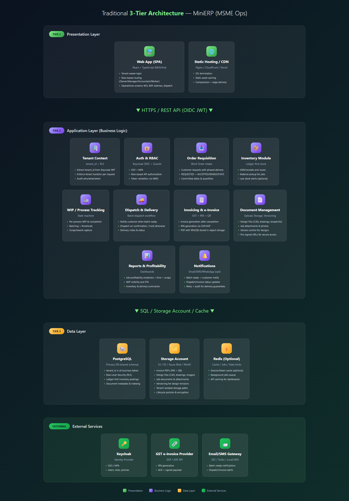
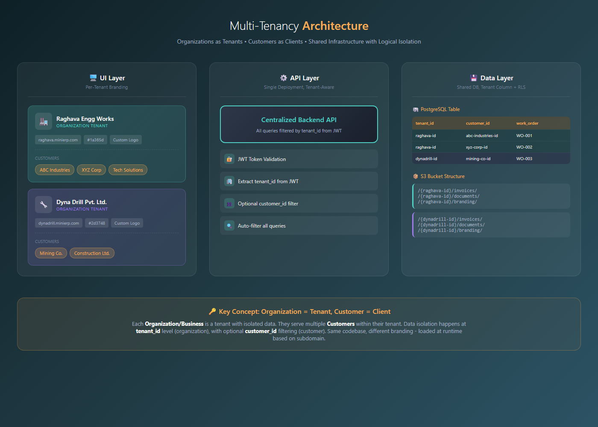
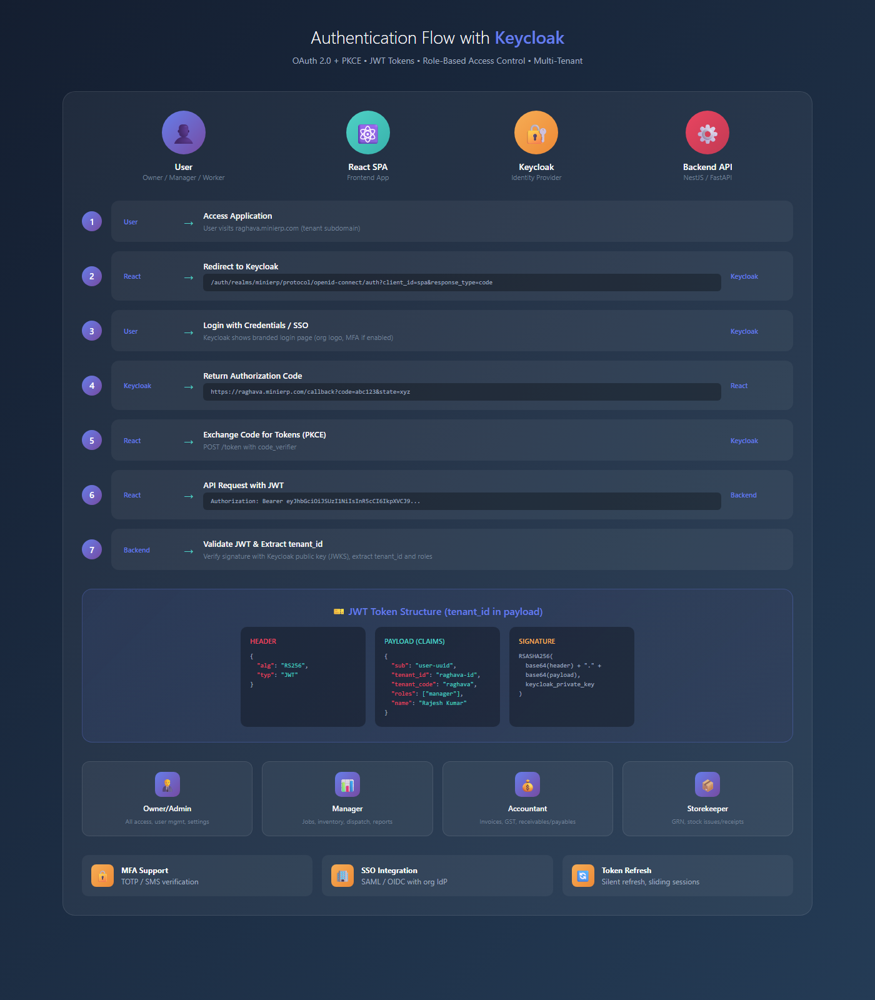
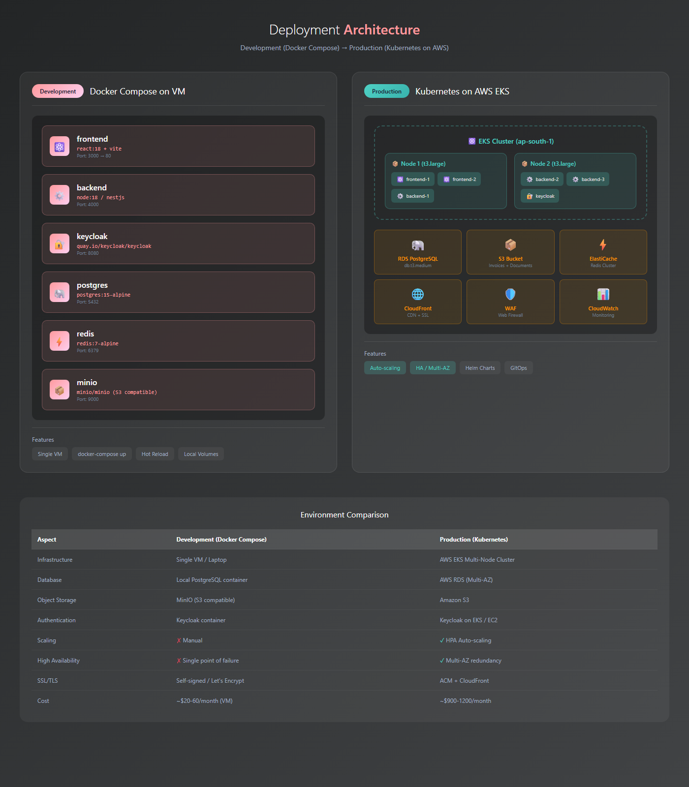

# High-Level Design Document
## MiniERP SaaS Platform for Local Businesses (India-first)

**Version:** 1.0  
**Date:** January 2026  
**Status:** Draft

---

## Table of Contents

1. [Executive Summary](#1-executive-summary)
2. [Business Context](#2-business-context)
3. [System Overview](#3-system-overview)
4. [Architecture Principles](#4-architecture-principles)
5. [High-Level Architecture](#5-high-level-architecture)
6. [Component Design](#6-component-design)
7. [Multi-Tenancy Strategy](#7-multi-tenancy-strategy)
8. [Authentication & Authorization](#8-authentication--authorization)
9. [Data Architecture](#9-data-architecture)
10. [Workflow & Eventing](#10-workflow--eventing)
11. [Infrastructure Design](#11-infrastructure-design)
12. [UI Screens](#12-ui-screens)
13. [CI/CD Pipeline](#13-cicd-pipeline)
14. [Non-Functional Requirements](#14-non-functional-requirements)
15. [Cost Estimation](#15-cost-estimation)
16. [Risks & Mitigations](#16-risks--mitigations)
17. [Appendix A: API Surface (Draft)](#appendix-a-api-surface-draft)

---

## 1. Executive Summary

This document outlines the High-Level Design for **MiniERP**, a **multi-tenant SaaS** platform built for **local businesses (1–50 employees)** such as job-work manufacturers, service MSMEs, traders/distributors, and contractors. The system digitizes day-to-day operations with a focus on:

- **Control + Clarity + Cash (CCC)**
- **Job/work-order profitability** (materials + time + scrap + overhead → profit %)
- **Real-time inventory & order visibility**
- **Fast onboarding**, low training, and low infrastructure cost

### Key Objectives

- Provide a secure, multi-tenant SaaS platform for multiple **business customers (tenants)**
- Enable **inventory → job-work → delivery/invoicing** workflows with traceability
- Provide **job-level profitability** and operational dashboards (visibility for owners/managers)
- Be **portable**: run as single-node VM for early stage, scale to Kubernetes when needed
- Optimize **cost**: minimize always-on infra and operational overhead

---

## 2. Business Context

### 2.1 Problem Statement

Small businesses often operate with manual registers, spreadsheets, and owner-dependent processes resulting in:

- Revenue leakage (invisible losses: scrap, rework, unbilled work, stock mismatch)
- Low operational visibility (WIP, stock, pending jobs, late deliveries)
- Weak data to access credit/growth (no reliable metrics)
- Increasing regulatory and customer pressure (GST, e-invoicing, audits)

### 2.2 Solution Overview

MiniERP provides:

- **Inventory & Purchases**: materials/products, stock movements, valuation, low stock alerts
- **Sales & Orders**: quotations → sales orders → delivery notes → invoices (GST-ready)
- **Job/Work Orders** (starting point): BOM/consumption, time tracking, scrap, WIP status
- **Workforce**: employees, attendance (optional), time entries per job
- **Reporting**: dashboards, profitability, stock aging, receivables/payables (phase-wise)

### 2.3 Target Users & Roles

| Role | Typical User | Key Needs |
|------|--------------|----------|
| Owner/Admin | Business owner | overall dashboard, approvals, profitability |
| Manager | shop/ops manager | jobs, inventory, dispatch, exceptions |
| Accountant | accounts person | invoices, GST reports, receivables/payables |
| Storekeeper | inventory handler | GRN, stock issues/receipts, counts |
| Worker/Employee | job worker | simple time entry, task updates (optional) |
| Platform Super Admin | SaaS operator | tenant onboarding, billing, support |

---

## 3. System Overview

### 3.1 High-Level Capabilities (Modules)

**Core Modules (Phase 1 / MVP):**
- **Tenant & User Management**
- **Inventory** (items, warehouses, stock ledger)
- **Job/Work Orders** (status, material consumption, time, scrap, profitability)
- **Document Management** (upload, storage, versioning for designs, invoices, job attachments)
- **Sales Orders & Delivery** (basic)
- **GST e-Invoice** (IRN generation + QR + invoice PDF)
- **Reporting Dashboard**

**Phase 2+:**
- Purchases (vendors, GRN, AP)
- Accounting-lite (AR/AP + ledger export)
- Multi-location/branch support
- Mobile companion (online-first, optional)

### 3.2 Typical User Journey (Job-work Manufacturer)

1. **Owner creates an Org (Tenant)** and completes basic setup (company profile, GST details, locations/warehouse if any).
2. **Owner onboards users** with roles (e.g., `manager`, `accountant`, `worker`) who will operate the app day-to-day.
3. **Customer/Client sends an Order Requisition / Work Order request** (PO / job-work order) with delivery phasing, for example:
   - total quantity: 100
   - **phase requests**: “first 20 quantity in next 2 days”, remaining later (date/quantity schedule)
   - specs/quality notes, packing instructions, delivery address
4. **Order acceptance & confirmation**: the Org reviews feasibility (capacity, inventory, lead time) and explicitly confirms:
   - `REQUESTED → ACCEPTED` (or `REJECTED / NEEDS_RENEGOTIATION`)
   - accepted quantities and committed dates per phase
5. **Manager records the confirmed Work Order** in MiniERP and creates/links:
   - customer profile
   - items/parts for the work order
   - expected quantity, promised dates, price/contract terms (if applicable)
6. **Manager receives materials/inputs** (from customer or internal stock) and **adds/records them into inventory** (stock ledger posting).
7. **Capacity-based planning**: based on worker/machine capacity, phase due dates, and priority, the **job/batch is picked up from inventory** and moved into execution.
8. **Production execution**: each process/stage updates status and quantities:
   - `IN_QUEUE` → `WIP` (in progress) per process
   - partial completions recorded as **batches**
   - scrap/rework recorded against the batch/job
9. **Batch readiness notification**: when a batch reaches a threshold quantity (often aligned to the next phase commitment), the system notifies the **customer** for delivery confirmation.
10. **Dispatch decision**:
   - If customer confirms: dispatch the batch (delivery note / dispatch record).
   - Else: hold and continue production until the next batch is ready.
11. **Order completion**: when the full ordered quantity is completed and dispatched/accepted, the manager **closes the work order**.
12. **Invoicing**: accountant/owner generates the final invoice and triggers **GST e-Invoice (IRN + QR)** as per configuration.

---

## 4. Architecture Principles

| Principle | Description |
|-----------|-------------|
| **API-First** | All functionality exposed via REST APIs (versioned) |
| **Portable** | Run on VM/Compose initially; move to managed containers/K8s later |
| **Multi-Tenant** | Shared infra with strict tenant isolation |
| **Modular Monolith → Services** | Start as modular monolith; extract services as load grows |
| **Security-First** | RBAC, audit trails, encryption, least privilege |
| **Operational Simplicity** | Few moving parts; avoid heavy ops tools early |
| **Observability** | structured logs, metrics, tracing hooks, error reporting |
| **12-Factor** | config via env, stateless services, health checks |

---

## 5. High-Level Architecture

### 5.1 Logical Architecture (3-tier)

#### Traditional 3-Tier Architecture (recommended baseline)

- **Presentation Tier**: Web UI (SPA) used by Owner/Manager/Accountant/Workers
- **Application/Business Tier**: Backend APIs implementing workflows, RBAC, tenant isolation
- **Data Tier**: PostgreSQL (system-of-record) + optional Redis cache + object storage for PDFs/docs



*Figure 5.1: MiniERP 3-Tier Architecture Diagram*

```
┌──────────────────────────────────────────────────────────────┐
│                         Frontend (SPA)                        │
│     Web App (Owner/Manager/Accountant) + Admin Console        │
└───────────────────────────────┬──────────────────────────────┘
                                │ HTTPS (OIDC / JWT via Keycloak)
┌───────────────────────────────┴──────────────────────────────┐
│                         API Layer                              │
│   API Gateway / BFF (optional) + Backend Application           │
│   - Auth/RBAC middleware  - Validation  - Rate limiting         │
└───────────────────────────────┬──────────────────────────────┘
                                │
┌───────────────────────────────┴──────────────────────────────┐
│                         Data Layer                             │
│     PostgreSQL (primary)  + Redis (cache/queues optional)      │
│     Object Storage (documents/invoices)                        │
└──────────────────────────────────────────────────────────────┘
```

### 5.2 Service Topology (recommended staged approach)

**Stage A (MVP, fastest onboarding):** Modular Monolith
- Single backend codebase with internal modules: `auth`, `inventory`, `jobs`, `sales`, `reports`

**Stage B (scale-out):** Extract services
- `auth/iam`, `inventory`, `jobs`, `billing/invoicing`, `reports`
- async eventing for stock movements, report snapshots, notifications

---

## 6. Component Design

### 6.1 Frontend Application (React SPA)

**Key Features:**
- Tenant-aware login (subdomain or tenant code)
- Role-based routing and screen visibility
- Responsive UI (desktop-first, works on tablets/mobile browsers)
- Optimistic UI for fast operations (stock issue, time entry)

**Recommended UI stack:**
- React + TypeScript
- Ant Design or MUI
- TanStack Query for data fetching + caching

### 6.2 Backend API (Modular Monolith initially)

**Recommended backend stack (easy hiring & speed):**
- Node.js + NestJS (or FastAPI if team is Python-first)
- PostgreSQL
- Redis (optional at MVP; add for caching and background jobs)

**Core responsibilities:**
- RBAC enforcement
- Tenant isolation middleware
- Business workflows (job transitions, stock posting, profitability calc)
- Audit logging (who changed what)

### 6.3 Background Jobs (Async)

Use background jobs for:
- Report generation (PDF/Excel)
- Email/SMS notifications
- Scheduled low-stock alerts
- Daily snapshot tables for dashboards

Implementation options:
- **Simple**: in-process worker + Postgres job table (MVP)
- **Standard**: Redis + BullMQ/Celery (scale)

### 6.4 Object Storage & Document Management

**Storage Account Purpose:**
The storage account serves as the centralized repository for all document and design assets in the MiniERP platform, enabling secure, scalable, and tenant-isolated document management.

**Stored Content Types:**
- **Generated Documents:**
  - Invoices (PDF with IRN + QR codes)
  - Delivery notes, GRNs, purchase orders
  - Reports (PDF/Excel exports)
- **User-Uploaded Attachments:**
  - Customer POs and work order specifications
  - Job-related documents (designs, drawings, quality specs)
  - Material receipts and supplier documents
  - Compliance certificates and regulatory documents
- **Design Files:**
  - Product designs and CAD files
  - Engineering drawings and blueprints
  - Image files (product photos, quality inspection images)
  - Design revisions and version history

**Storage Architecture:**
- **Tenant Isolation:** Each tenant's documents stored in separate prefixes/containers (e.g., `tenant-{tenant_id}/documents/`)
- **Organizational Structure:**
  ```
  tenant-{tenant_id}/
    ├── invoices/{year}/{month}/{invoice_id}.pdf
    ├── jobs/{job_id}/
    │   ├── designs/{version}/{filename}
    │   ├── attachments/{filename}
    │   └── photos/{filename}
    ├── customers/{customer_id}/documents/
    ├── inventory/{item_id}/images/
    └── reports/{report_type}/{date}/
  ```
- **Access Control:** Pre-signed URLs with expiration for secure document access
- **Versioning:** Enable object versioning for design files to track revisions
- **Lifecycle Policies:** Automated archival/deletion based on document type and age

**Storage Provider Options:**
- **AWS S3** (recommended for production): High durability, versioning, lifecycle policies, CloudFront CDN integration
- **Cloudflare R2**: S3-compatible, zero egress fees, cost-effective
- **Azure Blob Storage**: Good for Azure-native deployments
- **MinIO** (self-hosted): For on-premise or air-gapped deployments

**Document Management Features:**
- **Upload & Capture:**
  - Direct upload from web UI (drag-and-drop)
  - Mobile photo capture for job progress, quality checks
  - Bulk upload for batch document processing
  - File type validation and virus scanning (optional)
- **Metadata & Search:**
  - Document metadata stored in PostgreSQL (file path, size, type, uploader, tags)
  - Full-text search on document names and metadata
  - Tagging and categorization for easy retrieval
- **Preview & Viewing:**
  - In-browser preview for PDFs, images
  - Thumbnail generation for design files
  - Download with audit logging
- **Retention & Compliance:**
  - Configurable retention policies per document type
  - Immutable storage for audit-critical documents (invoices, compliance)
  - Automated backup to secondary storage/region

---

## 7. Multi-Tenancy Strategy

### 7.1 Tenant Isolation Model (recommended)

**Approach: Shared DB, shared schema + `tenant_id` + Postgres Row Level Security (RLS).**

Why this approach:
- Lowest operational complexity
- Easy onboarding (no schema provisioning per tenant)
- Works well for 1–5k tenants with proper indexing and partitions

**Decision (confirmed):** MiniERP will start with **shared schema + `tenant_id`**.



*Figure 7.1: MiniERP Multi-Tenancy Architecture - Shared Schema with Tenant Isolation*

Alternative (if strict isolation required later):
- **Schema-per-tenant** (more complexity)
- **DB-per-tenant** (highest cost, used for enterprise tier)

### 7.2 Tenant Routing

Tenant resolved via:
- **Subdomain**: `tenantA.minierp.com` (preferred), OR
- Tenant code on login screen, OR
- Custom domain mapping (paid tier)

Tenant ID placed into the JWT and also used server-side for all queries.

---

## 8. Authentication & Authorization

### 8.1 Decision: Keycloak (SSO + MFA)

MiniERP will use **Keycloak** from day-1 to support:
- **SSO** (OIDC; SAML federation if required by a tenant)
- **MFA** (TOTP/WebAuthn as per tenant policy)
- Centralized user management and better auditability

Keycloak issues JWT access tokens consumed by both:
- Frontend (route guards, UI personalization)
- Backend (API authorization and tenant isolation)

### 8.2 Keycloak High-Level Flow (SPA + PKCE)



*Figure 8.1: MiniERP Authentication Flow with Keycloak (SPA + PKCE)*

```
User Browser ──(1) Login Redirect──▶ Keycloak
User Browser ◀─(2) Auth Code──────── Keycloak
User Browser ──(3) Code Exchange (PKCE)──▶ Keycloak
User Browser ◀─(4) Access Token (JWT)──── Keycloak
User Browser ──(5) API Calls (Bearer JWT)▶ Backend API
Backend API  ──(6) Validate JWT (JWKS)───▶ Keycloak (public keys)
```

### 8.3 Token Claims (Tenant-aware)

Keycloak token must include:
- `tenant_id` (UUID) and optionally `tenant_code` (string)
- roles (realm or client roles)

Backend rejects requests with missing/invalid tenant claims.

### 8.4 RBAC

Example roles:
- `tenant_admin`, `owner`, `manager`, `accountant`, `storekeeper`, `worker`, `platform_admin`

Authorization enforced in backend guards; frontend uses the same token claims to hide/show screens.

### 8.5 MFA Policy

MFA is enabled for:
- **platform_admin** (always)
- tenant roles based on policy (recommended: `tenant_admin`, `owner`, `accountant`)

---

## 9. Data Architecture

### 9.1 Entity Overview

All tenant data tables include `tenant_id`.

**Core entities:**
- `tenants`, `users`, `roles`
- `items`, `warehouses`, `stock_ledger`
- `job_orders`, `job_materials`, `job_time_entries`, `job_scrap`
- `customers`, `sales_orders`, `invoices`, `payments` (phase-wise)
- `einvoices` (IRN, ACK, signed invoice, QR)
- `documents` (metadata: storage path, type, size, tags, linked entities)
- `audit_logs`

### 9.2 Data Posting Model (Stock Ledger)

**Stock Ledger as the source of truth**:
- Every stock change is an immutable ledger entry
- `items.current_stock` is derived (materialized) for speed

This avoids "mystery stock" and supports audits.

### 9.3 Document Storage Model

**Hybrid Storage Approach:**
- **PostgreSQL**: Stores document metadata (`documents` table)
  - `id`, `tenant_id`, `storage_path`, `file_name`, `file_type`, `file_size`
  - `entity_type`, `entity_id` (polymorphic: links to jobs, invoices, customers, etc.)
  - `uploaded_by`, `uploaded_at`, `tags`, `description`
  - `version` (for design file revisions), `is_archived`
- **Object Storage (S3/R2/MinIO)**: Stores actual file content
  - Path structure: `tenant-{tenant_id}/{entity_type}/{entity_id}/{file_name}`
  - Versioned storage for design files
  - Pre-signed URLs generated on-demand with expiration

**Benefits:**
- Fast metadata queries (PostgreSQL indexes)
- Scalable file storage (object storage)
- Tenant isolation at storage path level
- Audit trail via `documents` table + `audit_logs`

---

## 10. Workflow & Eventing

### 10.1 Job Workflow (example)

`DRAFT → RELEASED → IN_PROGRESS → READY → DISPATCHED → INVOICED → CLOSED`

Rules:
- Stock issue allowed only after `RELEASED`
- Profitability computed continuously; final at `CLOSED`

### 10.2 e-Invoice Workflow (MVP scope)

1. Accountant/Owner generates invoice in MiniERP
2. System validates GSTIN/HSN/tax breakdown and invoice totals
3. System generates **IRN** by calling the configured e-Invoice API provider (GSP/ASP)
4. System stores ACK details and signed payload (as required) + QR
5. Invoice PDF generated with **IRN + QR** and stored in object storage

Notes:
- Provider integration must be behind an interface to support swapping vendors.
- Calls must be idempotent (invoice_id + attempt key).
- Failures should be retriable with audit logs and user-visible status.

### 10.3 Eventing (when to introduce)

Introduce events when you split services or need async:
- `job.created`, `job.status_changed`
- `stock.posted`, `stock.low`
- `invoice.generated`, `payment.received`

Transport options:
- Postgres outbox table (MVP)
- Redis Streams/RabbitMQ/SQS (scale)

---

## 11. Infrastructure Design



*Figure 11.1: MiniERP Deployment Architecture - Development and Production Environments*

### 11.1 Development Environment (Docker Compose)

Local: `frontend`, `backend`, `postgres`, `redis` (optional), `minio` (S3-compatible object storage for document management).

### 11.2 Production Options

#### Option A: Single VM (lowest cost, fastest to operate)
- Nginx + Docker Compose
- Postgres on same VM (or managed DB if possible)
- Daily backups to object storage

#### Option B: Managed PaaS (recommended early SaaS)
- Frontend: Vercel/Netlify/CloudFront
- Backend: Render/Railway/Fly.io/DigitalOcean App Platform
- DB: Managed Postgres (Supabase/Railway/DO Managed)
- Redis: Upstash (as needed)

#### Option C: Cloud-native (scale)
- AWS ECS/EKS, RDS Postgres, ElastiCache, S3, CloudFront, WAF

### 11.3 Storage Account Configuration

**Storage Account Setup:**
- **Bucket/Container Name:** `minierp-documents-{environment}` (e.g., `minierp-documents-prod`)
- **Access Control:**
  - Private buckets with IAM/access keys for backend service
  - Public access disabled
  - CORS configured for frontend domain only
- **Versioning:** Enabled for design files (job designs, CAD files)
- **Lifecycle Policies:**
  - Invoices: Retain for 7 years (compliance), then move to Glacier/archive tier
  - Job documents: Retain for 3 years, then archive
  - Temporary uploads: Delete after 30 days if not linked to entity
- **Encryption:**
  - Server-side encryption (SSE-S3 or SSE-KMS)
  - Encryption at rest enabled
  - HTTPS-only access (TLS 1.2+)
- **Backup Strategy:**
  - Cross-region replication for critical documents (invoices, compliance)
  - Daily snapshots of storage account configuration
  - Point-in-time recovery for versioned objects

**Storage Account Credentials:**
- Stored as environment variables (never in code)
- Use IAM roles (AWS) or service principals (Azure) when possible
- Rotate access keys quarterly
- Separate credentials per environment (dev/staging/prod)

**Storage Monitoring:**
- Track storage usage per tenant (for billing/quota)
- Monitor upload/download rates
- Alert on unusual access patterns
- Track storage costs and optimize lifecycle policies

### 11.4 Operational Needs

- Backups: automated + restore drills
- Monitoring: metrics + logs + alerting
- Admin tooling: tenant disable, data export, support impersonation (audited)

---

## 12. UI Screens

### 12.1 Screen Inventory (MVP)

**Core Screens:**
1. **Login** (`01-login.html`) - Tenant-aware login with Keycloak SSO/MFA
2. **Dashboard** (`02-dashboard.html`) - Overview metrics, active jobs, pending tasks, low stock alerts
3. **Consumer Orders** (`03-consumer-orders.html`) - Manage customer orders with:
   - Active orders, ready for dispatch, dispatched counts
   - Inline editing of quantity and due dates
   - Navigation to consumer edit
   - Order status tracking
4. **Order Intake** (`04-order-intake.html`) - New order request form with:
   - Customer selection (existing/new)
   - Order description, quantity, unit
   - Phased delivery requirements (quantity + dates per phase)
   - Design type and reference number
   - Specifications, packing instructions
   - Delivery address
   - Pricing & contract terms
   - Design files & attachments upload
   - Order status (REQUESTED → ACCEPTED/REJECTED)
5. **Workforce Management** (`05-workforce-management.html`) - Worker management with:
   - Worker list with attendance (30/30 format)
   - Overtime tracking (days/hours)
   - Expandable profiles (phone, address, employment details)
   - KYC document management (Aadhar, PAN upload/view)
   - Add/Edit/Delete workers
6. **Job Orders** (`06-job-orders.html`) - Job/work order list with:
   - Job number, customer, description
   - Quantity progress tracking
   - Status badges (DRAFT, RELEASED, IN_PROGRESS, READY, DISPATCHED, CLOSED)
   - Due dates and progress bars
7. **Job Detail** (`07-job-detail.html`) - Detailed job view with:
   - Job information and status
   - Progress tracking
   - Materials consumed table
   - Profitability metrics (cost, revenue, margin)
   - Document attachments
   - Activity timeline
   - Quick actions (add entry, issue materials, update status)
8. **Scrap Details** (`08-scrap-details.html`) - Scrap management with:
   - Scrap submission history (line graph showing tons over time)
   - Scrap pricing table (per kg/ton for each type)
   - Recent submissions sidebar
   - Scrap entries table (job, type, quantity, value)
   - Stats dashboard (total scrap, value, entries, avg price)
9. **Expense Tracker** (`09-expense-tracker.html`) - Expense management with:
   - Expense list with categories (Raw Materials, Labor, Utilities, Maintenance, Transport, Other)
   - Vendor information
   - Payment status (Paid, Pending, Overdue)
   - Stats dashboard (total expenses, entries, pending payments, avg monthly)
   - Add/Edit/Delete expenses

**Additional Screens (Phase 2):**
- Stock Movements (GRN/Issue/Adjust)
- Items & Warehouses management
- Invoices list & generation
- Document viewer/preview
- Document management (list, search, download)
- Reports (profitability, WIP, low stock)
- User Management
- Tenant Settings

**UI Mockup Files:**
All UI mockups are available in `ui-mockups/` directory:
- `01-login.html` / `01-login.png` - Login screen
- `02-dashboard.html` / `02-dashboard.png` - Dashboard
- `03-consumer-orders.html` / `03-consumer-orders.png` - Consumer Orders management
- `04-order-intake.html` / `04-order-intake.png` - Order Intake form
- `05-workforce-management.html` / `05-workforce-management.png` - Workforce Management
- `06-job-orders.html` / `06-job-orders.png` - Job Orders list
- `07-job-detail.html` / `07-job-detail.png` - Job Order detail view
- `08-scrap-details.html` / `08-scrap-details.png` - Scrap Details & tracking
- `09-expense-tracker.html` / `09-expense-tracker.png` - Expense Tracker

### 12.2 Screen Flow (Happy Path)

**Order-to-Delivery Flow:**
1. **Login** → Tenant selection/authentication via Keycloak
2. **Dashboard** → View overview metrics and pending tasks
3. **Order Intake** → Customer submits order request with phased delivery requirements
4. **Consumer Orders** → Manager reviews and accepts order (REQUESTED → ACCEPTED)
5. **Job Orders** → Manager creates job order from accepted consumer order
6. **Job Detail** → Manager issues materials, tracks progress
7. **Workforce Management** → Assign workers, track attendance/overtime
8. **Job Detail** → Workers add time entries, record scrap
9. **Scrap Details** → View scrap submissions and pricing
10. **Job Detail** → Mark batch ready, notify customer
11. **Consumer Orders** → Update order status (READY → DISPATCHED)
12. **Expense Tracker** → Record expenses (materials, labor, utilities)
13. **Job Detail** → View profitability, close job when complete
14. **Invoices** → Generate invoice with GST e-Invoice (IRN + QR)
15. **Dashboard** → Review reports and metrics

---

## 13. CI/CD Pipeline

### 13.1 Repositories

Option A: mono-repo (`frontend/`, `backend/`, `infra/`)  
Option B: two repos (UI + API)

**Recommendation:** Mono-repo for MVP (simpler onboarding).

### 13.2 Pipeline Stages

- PR: lint → unit tests → build
- Merge to `dev`: build + deploy to dev
- Merge `dev → main`: tag version + deploy to staging/prod

### 13.3 IaC

Terraform (preferred) for cloud resources; Compose manifests for VM deployments.

---

## 14. Non-Functional Requirements

| Metric | Target |
|--------|--------|
| API Response Time (P95) | < 500ms |
| Job list load (P95) | < 2s |
| Inventory search | < 300ms (indexed) |
| Year-1 scale assumption | 3–5 tenants/year; 30–50 users/tenant |
| Typical concurrency | 5–15 concurrent users/tenant |
| Uptime SLA | 99.5% (MVP) → 99.9% (scale) |
| RPO | < 24h (VM) → < 1h (managed) |
| RTO | < 8h (VM) → < 4h (managed) |
| Data isolation | strict tenant isolation via RLS / tenant middleware |
| Auditability | immutable stock ledger + audit logs |

---

## 15. Cost Estimation

> Notes: Estimates vary by region/provider. This section provides **relative guidance** for cost-effective rollout.

### 15.1 MVP (<= 50 tenants, low traffic)

| Component | Option | Est. Monthly Cost |
|----------|--------|-------------------|
| Backend + DB | Single VM (4–8GB) | $20–$60 |
| Storage Account (Documents) | S3/R2/B2 (assumes ~50GB storage, ~5GB transfer) | $5–$15 |
| Email | SES/Mailgun | $0–$10 |
| Monitoring | basic | $0–$20 |
| **Total** |  | **$25–$105/month** |

**Storage Cost Notes (MVP):**
- Average: ~1GB per tenant (invoices, job docs, designs)
- Design files (CAD, images): larger files but fewer in number
- Lifecycle policies reduce costs (archive old documents)

### 15.2 Early SaaS (100–300 tenants)

| Component | Option | Est. Monthly Cost |
|----------|--------|-------------------|
| Backend | PaaS | $50–$150 |
| DB | Managed Postgres | $30–$120 |
| Cache/Jobs | Upstash/Redis | $0–$30 |
| Storage Account + CDN | S3/R2 + CDN (assumes ~300GB storage, ~30GB transfer) | $10–$40 |
| **Total** |  | **$90–$340/month** |

**Storage Cost Notes (Early SaaS):**
- Average: ~1GB per tenant (invoices, job docs, designs)
- CDN for faster document delivery (especially for design previews)
- Versioning adds ~20–30% storage overhead for design files

### 15.3 Scale (1000+ tenants, higher concurrency)

Cloud-native: $600+/month depending on HA, replicas, analytics, and support tooling.

---

## 16. Risks & Mitigations

| Risk | Impact | Mitigation |
|------|--------|------------|
| Tenant data leakage | High | tenant middleware + RLS + tests + code reviews |
| Stock mismatch due to workflow bugs | High | ledger-first model, idempotent posting, audit logs |
| Poor onboarding / low adoption | High | simple UX, guided setup, templates, in-app tips |
| Cost overrun | Medium | staged architecture, autoscaling only when needed |
| Performance degradation with growth | Medium | indexing, caching, read replicas, partitioning |
| Regulatory scope creep (GST/eInvoice) | Medium | feature flags, phased rollout, integrations as add-on |
| Backup/restore failure | High | automated backups + monthly restore drills |
| Storage cost overrun (large design files) | Medium | file size limits, compression, lifecycle policies, tenant quotas |
| Document access/security breach | High | pre-signed URLs with expiration, access logging, encryption at rest |

---

## Appendix A: API Surface (Draft)

```yaml
# Auth (Keycloak integration)
POST /api/v1/auth/login                      # Keycloak OIDC login redirect
POST /api/v1/auth/refresh                    # Refresh token
POST /api/v1/auth/logout                     # Logout
GET  /api/v1/auth/me                         # Get current user profile

# Tenant (platform admin)
POST /api/v1/tenants                         # Create tenant
GET  /api/v1/tenants                         # List tenants
GET  /api/v1/tenants/:id                     # Get tenant details
PATCH /api/v1/tenants/:id/status             # Update tenant status
PUT  /api/v1/tenants/:id                     # Update tenant settings

# Users (tenant admin)
GET  /api/v1/users                            # List users (with filters: role, status)
POST /api/v1/users                            # Create user
GET  /api/v1/users/:id                        # Get user details
PUT  /api/v1/users/:id                        # Update user
DELETE /api/v1/users/:id                      # Delete user
PATCH /api/v1/users/:id/status                # Update user status (active/inactive)

# Dashboard
GET  /api/v1/dashboard                        # Get dashboard metrics and stats
GET  /api/v1/dashboard/tasks                  # Get pending tasks and alerts

# Consumer Orders
GET  /api/v1/consumer-orders                  # List consumer orders (with filters: status, customer)
GET  /api/v1/consumer-orders/stats            # Get order stats (active, ready, dispatched, overdue)
GET  /api/v1/consumer-orders/:id               # Get order details
POST /api/v1/consumer-orders                  # Create consumer order
PUT  /api/v1/consumer-orders/:id               # Update order
PATCH /api/v1/consumer-orders/:id/quantity    # Update order quantity (inline edit)
PATCH /api/v1/consumer-orders/:id/due-date    # Update order due date (inline edit)
PATCH /api/v1/consumer-orders/:id/status     # Update order status
DELETE /api/v1/consumer-orders/:id            # Delete order

# Order Intake (Order Requests)
GET  /api/v1/order-requests                   # List order requests (with filters: status)
GET  /api/v1/order-requests/:id                # Get order request details
POST /api/v1/order-requests                   # Create order request (from intake form)
PUT  /api/v1/order-requests/:id               # Update order request
PATCH /api/v1/order-requests/:id/accept        # Accept order request (REQUESTED → ACCEPTED)
PATCH /api/v1/order-requests/:id/reject        # Reject order request (REQUESTED → REJECTED)
POST /api/v1/order-requests/:id/convert        # Convert accepted request to job order

# Customers/Consumers
GET  /api/v1/customers                        # List customers (with search)
GET  /api/v1/customers/:id                     # Get customer details
POST /api/v1/customers                        # Create customer
PUT  /api/v1/customers/:id                     # Update customer
DELETE /api/v1/customers/:id                  # Delete customer

# Inventory
GET  /api/v1/items                            # List items (with filters: category, stock status)
POST /api/v1/items                            # Create item
GET  /api/v1/items/:id                        # Get item details
PUT  /api/v1/items/:id                        # Update item
DELETE /api/v1/items/:id                     # Delete item
GET  /api/v1/warehouses                       # List warehouses
POST /api/v1/warehouses                      # Create warehouse
POST /api/v1/stock/postings                   # Create stock posting (issue/receipt/adjust)
GET  /api/v1/stock/ledger                     # Get stock ledger (with filters)
GET  /api/v1/stock/low                        # Get low stock items

# Jobs
GET  /api/v1/jobs                             # List jobs (with filters: status, customer)
GET  /api/v1/jobs/:id                         # Get job details
POST /api/v1/jobs                             # Create job order
PUT  /api/v1/jobs/:id                         # Update job
PATCH /api/v1/jobs/:id/status                 # Update job status
POST /api/v1/jobs/:id/materials               # Add material consumption entry
GET  /api/v1/jobs/:id/materials               # Get job materials consumed
POST /api/v1/jobs/:id/time                    # Add time entry
GET  /api/v1/jobs/:id/time                    # Get job time entries
POST /api/v1/jobs/:id/scrap                   # Record scrap entry
GET  /api/v1/jobs/:id/scrap                   # Get job scrap entries
GET  /api/v1/jobs/:id/profitability           # Get job profitability metrics
POST /api/v1/jobs/:id/issue-materials         # Issue materials to job
POST /api/v1/jobs/:id/mark-ready              # Mark batch ready for dispatch
POST /api/v1/jobs/:id/dispatch                # Dispatch job/batch

# Workforce Management
GET  /api/v1/workforce                        # List workers (with filters: department, status)
GET  /api/v1/workforce/stats                  # Get workforce stats
GET  /api/v1/workforce/:id                    # Get worker details
POST /api/v1/workforce                        # Create worker
PUT  /api/v1/workforce/:id                    # Update worker
DELETE /api/v1/workforce/:id                  # Delete worker
GET  /api/v1/workforce/:id/attendance         # Get worker attendance (30/30 format)
GET  /api/v1/workforce/:id/overtime           # Get worker overtime (days/hours)
POST /api/v1/workforce/:id/kyc                # Upload KYC document (Aadhar/PAN)
GET  /api/v1/workforce/:id/kyc                # Get worker KYC documents
GET  /api/v1/workforce/:id/kyc/:docId         # Get/view KYC document

# Scrap Management
GET  /api/v1/scrap                            # List scrap entries (with filters: type, job)
GET  /api/v1/scrap/stats                      # Get scrap stats (total tons, value, entries)
GET  /api/v1/scrap/history                    # Get scrap submission history (for line graph)
GET  /api/v1/scrap/pricing                    # Get scrap pricing table (per type)
POST /api/v1/scrap                            # Create scrap entry
GET  /api/v1/scrap/:id                        # Get scrap entry details
PUT  /api/v1/scrap/:id                        # Update scrap entry
DELETE /api/v1/scrap/:id                      # Delete scrap entry
PUT  /api/v1/scrap/pricing                    # Update scrap pricing (per type)

# Expense Tracker
GET  /api/v1/expenses                         # List expenses (with filters: category, status, month)
GET  /api/v1/expenses/stats                  # Get expense stats (total, entries, pending, avg)
POST /api/v1/expenses                        # Create expense
GET  /api/v1/expenses/:id                    # Get expense details
PUT  /api/v1/expenses/:id                    # Update expense
DELETE /api/v1/expenses/:id                  # Delete expense
GET  /api/v1/expenses/categories             # Get expense categories
GET  /api/v1/expenses/vendors                # List vendors

# Sales & Invoices (MVP basic)
GET  /api/v1/invoices                        # List invoices
POST /api/v1/invoices                        # Create invoice
GET  /api/v1/invoices/:id                    # Get invoice details
GET  /api/v1/invoices/:id/pdf                # Get invoice PDF
POST /api/v1/invoices/:id/generate-einvoice  # Generate GST e-Invoice (IRN + QR)

# Reports
GET  /api/v1/reports/dashboard               # Dashboard reports
GET  /api/v1/reports/profitability           # Profitability reports
GET  /api/v1/reports/inventory               # Inventory reports
GET  /api/v1/reports/wip                     # Work-in-progress reports

# Documents & Storage
POST   /api/v1/documents/upload              # Upload file (multipart/form-data)
GET    /api/v1/documents                     # List documents (with filters: entity_type, entity_id, tags)
GET    /api/v1/documents/:id                 # Get document metadata
GET    /api/v1/documents/:id/download        # Get pre-signed download URL
GET    /api/v1/documents/:id/preview          # Get pre-signed preview URL
DELETE /api/v1/documents/:id                 # Delete document (soft delete or hard delete)
POST   /api/v1/documents/:id/versions        # Upload new version of design file
GET    /api/v1/documents/:id/versions         # List all versions of a document
PUT    /api/v1/documents/:id                  # Update metadata (tags, description)
GET    /api/v1/documents/upload-url           # Get pre-signed upload URL (for direct client upload)
POST   /api/v1/jobs/:id/documents            # Upload document linked to job
POST   /api/v1/invoices/:id/documents         # Upload document linked to invoice
GET    /api/v1/jobs/:id/documents             # List documents for a job
GET    /api/v1/invoices/:id/documents         # List documents for an invoice
POST   /api/v1/order-requests/:id/documents    # Upload design files for order request
GET    /api/v1/order-requests/:id/documents    # List documents for order request
```

